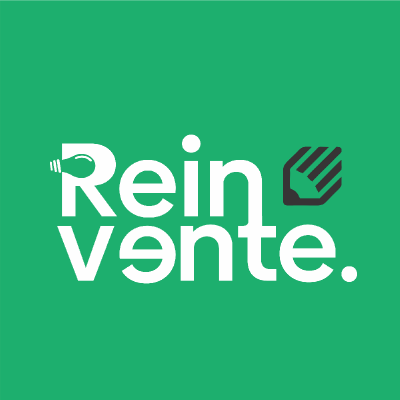

<h1 align="center">
   
    
   
  Equipe Reinvente
   
</h1>

<h4 align="center">Reinvente seu conceito e inove com a gente!</h4>

# Fundação

A Equipe Reinvente foi fundada visando o Hackaton da Universidade Federal Ceará que ocorreu no ano de 2023, o tema escolhido foi: "Falta de divulgação e comunicação, de um turismo receptivo e do artesanato, no municipio de Itapajé", tendo este tema em mente, discutimos e projetamos a nossa solução para tal abordagem e o nome escolhido foi: Itapastur!

   
    
   
  
  
   

## Sobre

O ItapasTur é um aplicativo para difundir o conhecimento de pontos turísticos, lojas e eventos no municipio de Itapajé, o mesmo é similar a uma rede social, porém, para um público diferente, o mesmo foi desenvolvido num período de 14 dias por uma equipe de 5 pessoas, dentre elas, apenas um estudante da universidade.

## Funcionalidades
O nosso escopo abrange as seguintes funcionalidades:
* Criar, Editar, Ver e Deletar empreendimentos.
* Criar, Editar, Ver e Deletar pontos turísticos.
* Criar, Editar, Ver e Deletar eventos.
* Criar, Editar, Ver e Deletar comentários.
* Cadastro e Login de Usuários.
* Ver, Editar e Deletar Usuários.
* Integração com Google Maps para traçar rotas.
* Criar/Deletar Likes em empreendimentos

## Tecnologias

As tecnologias principais utilizadas na construção do nosso projeto são as seguintes:
- 
- 
- 

## Repositórios

Estes são os links para acessar os nossos repositórios:
- 
- 

## Contribuidores

Conheça a nossa equipe!

<table>
  <tbody>
    <tr>
      <td align="center" valign="top" width="14.28%"><a href="https://github.com/dev-Gois"> <b>Matheus Gois</b></a> <a title="Leader">👑</a><a title="Requisitos">📝</a> </a><a title="UX/UI">🎨</a> <a title="Documentação">📖</a> <a title="Equipe Backend">💻</a> <a title="Code Review">👀</a> </td>
      <td align="center" valign="top" width="14.28%"><a href="https://github.com/carlosjefte"> <b>Carlos Jefté</b></a> <a title="Requisitos">📝</a> <a title="Equipe Mobile">📱</a> <a title="Gestor de Projetos">📊</a> </td>
        <td align="center" valign="top" width="14.28%"><a href="https://github.com/dev-bragask"> <b>Nicolas Braga</b></a> <a title="Equipe Mobile">📱</a></td>
        <td align="center" valign="top" width="14.28%"><a href="https://github.com/MattBastos"> <b>Matthews Bastos</b></a> <a title="Equipe Mobile">📱</a> <a title="Requisitos">📝</a></td>
        <td align="center" valign="top" width="14.28%"><a href="https://github.com/junior4g"> <b>Raimundo Junior</b></a> <a title="Equipe Backend">💻</a> <a title="Requisitos">📝</a> <a title="Code Review">👀</a></td>
    </tr>
  </tbody>
</table>

